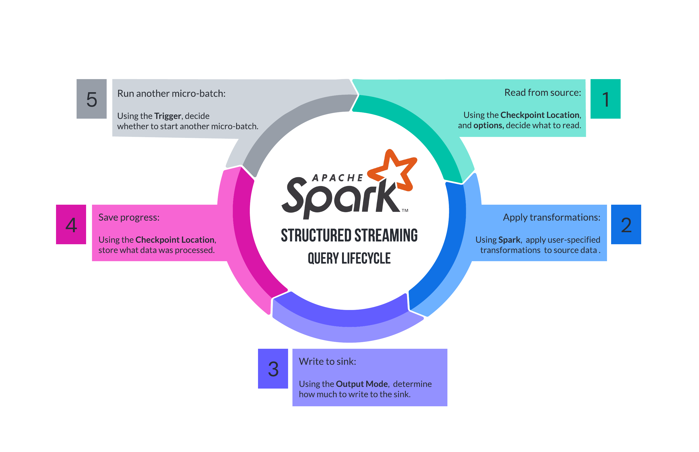

Let's recap how far we've come:

- We talked about the microbatch [execution model](./ss-manual-execution-model.md), including output modes and triggers
- We discussed [creating sources](./ss-manual-streaming-dataframes.html)
- We then covered [stateless](./ss-manual-stateless.html) transformations to `DataFrame`s

There are just a few things left to cover before we have all the tools for an end-to-end example:

- Configuring a sink to write the results of your operators
- Ensuring fault-tolerance through a _checkpoint location_

## The most important parts of `writeStream`

Every DataFrame exposes the `.writeStream` method, which gives you back an interface that exposes the following methods (it also exposes a few more that we will discuss later):

- `format`, which consumes a string of the sink you'd like to write to. See all sinks here (TODO).
- `option`, which lets you set key-value pairs to configure your sink and query

Each call to these methods returns the same interface, so you can chain calls to `.option` together. You can't chain multiple calls to `.format`, though (unfortunately, you can't yet write to multiple sinks at the same time with Structured Streaming).

### Sink configuration with `format` and `option`

Structured Streaming supports multiple _sinks_. Here is a brief overview of production sinks:

- **File sink**: stores output in files in the following formats: `delta`, `parquet`, `orc`, `json`, and `csv`. You specify the format that you'd like with `.format("delta")`, for example, and can supply the directory under which to store files with `.option("path", "path/to/dir")`. See more in the reference (TODO).
- **Kafka sink**: stores output to a given Kafka topic. You use `.format("kafka")`, and specify a few more options (like topic-name), described in the reference (TODO).
- **Foreach sink**: perform arbitrary computation over records in the output. See the section on Advanced Stateless Stream Processing for more details (TODO).

In testing environments, you can use either of the following two sinks:

- **Console sink (for debugging)** Stores the output in-memory, and writes the result to Spark's application logs. It is specified with `.format("console")`—that's it!
- **Memory sink (for debugging)** Stores the output in-memory. TODO: why is this ever useful?

As you can see, configuring a sink requires a combination of using the `.format` and `.option` methods.

### Checkpoint locations with `option`

TODO: when is a checkpoint location strictly required? What happens when you don't give one? Where do credentials to write to S3 come from?

There are two neat things that streaming engines provide over repeatedly running batches yourself:

- Streaming engines are _incremental_: they process only _new_ source data.
- Streaming engines are _fault-tolerant_: they guarantee delivery semantics (i.e. like exactly-once) even with arbitrary node failures.

Structured Streaming achieves these two properties with the use of a _checkpoint location_. A checkpoint location is a directory in cloud storage (like S3), to which Structured Streaming writes its progress for a particular query. If it processes rows 10-20 in batch 1, it will record this progress in the checkpoint location; then, when starting batch 2, it will know to pick up from row 20.

Checkpoint locations are specified via `.option("checkpointLocation", "path/to/your/location")`, and you should set one after configuring your sink. Since Structured Streaming stores its progress _per query_, each query should have a unique checkpoint location!

Tip: your checkpoint location should be a path that describes your query. To avoid cluttering your cloud storage, you could even namespace it to your team. For a fraud detection pipeline, `/trust-and-safety/fraud-pipeline` would be a great choice. See more considerations here (TODO).

## The Structured Streaming Lifecycle

TODO.

  

## The Structured Streaming Checklist

It's very reasonable to feel like you wouldn't be able to configure a Structured Streaming job from memory. That's totally fine! In fact, for this particular reason, you can use the following checklist to get started (note: Step 4.4 mentions a _watermark_, which you don't have to worry about for now; we'll get to it shortly!):

1. Create a `spark` variable. See [here](https://spark.apache.org/docs/latest/sql-getting-started.html#starting-point-sparksession).
2. Call `spark.readStream`
   1. Call `.format` to choose your source. List of sources here (TODO).
   2. Call `.option` as many times as needed to configure your source.
   3. Call `.load` to create a streaming `DataFrame`
3. Call (as many) operators (as you'd like) on your streaming `DataFrame`
   1. Call `.filter` to filter rows, `.select` to select columns
   2. Call other stateless operators (here).
   3. Call stateful operators, which we discuss later (here).
4. Call `.writeStream`
   1. Call `.format` to choose your sink. List of sinks here (TODO).
   2. Call `.option` as many times as needed to configure your sink.
   3. Call `.option` to set a checkpoint location, described here (TODO).
   4. Optional: call `.withWatermark` with stateful operators, described here (TODO).
   5. Optional: call `.outputMode` to set an output mode. List of output modes here (TODO).
   6. Optional: call `.trigger` to set a trigger. List of triggers here (TODO).
5. Call `.start`

## An End-to-End Example

Now we follow the Structured Streaming Checklist to create an end-to-end example.

## Additional Configurations

As we discussed in the Execution Model

- `trigger`, which consumes the `Trigger` you want your query to use
- `outputMode`, which consumes the `OutputMode` you want your query to use
