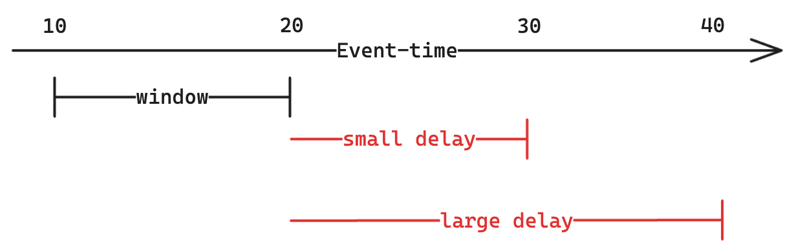

Our first type of stateful query is the _aggregation_. As discussed in the introduction to stateful operators, there are two things that are top-of-mind for us:

- If events can come out-of-order, how do we know when an aggregate is complete?
- If we have to keep state for our aggregates, how do we make sure state doesn't grow to be infinitely large?

## What is a streaming aggregation?

Streaming aggregations allow you to compute statistics over groups of your data—it's very similar to a `GROUP BY` in SQL, but with the added complication that records can come out-of-order. Let's say that we have a stream of sales and want to compute the _median_ sale-price per hour. To do this, Structured Streaming needs to keep _state_ for each window. For example, let's say we make the following sales at a store:

- `\$10` at 2:30pm
- `\$15` at 2:45pm
- `\$30` at 3:30pm

In this case, Structured Streaming's _state_ would look like:

- [2pm, 3pm): `[\$10, \$15]`
- [3pm, 4pm): `[\$30]`

Then, let's say it receives more records:

- `\$20` at 2:15pm
- `\$25` at 3:15pm

Strucutred Streaming would then update its state to look like:

- [2pm, 3pm): `[\$10, \$15, \$20]`
- [3pm, 4pm): `[\$30, \$25]`

Clearly, we're receiving events out-of-order. Structured Streaming is able to deal with this by buffering records in state, based on the records' event-times. The central question is, though: if Structured Streaming is buffering records, when will it _emit_ an aggregate? There are two main options:

1. It can emit an aggregate once it's reasonably confident that aggregate won't change.
2. It can emit an aggregate every time an aggregate changes.

There are tradeoffs to both these approaches, and we explore them below.

### Emitting aggregates when they won't change

When will an aggregate not change? Let's take our example from earlier. If we have a time window that ends at 3pm, the aggregate for that window won't change, once we stop receiving records with event-times before 3pm. So, if the streaming engine has a timestamp in event-time before which it won't receive any more records, it can close all aggregates less than that timestamp.

Such a timestamp is called a _watermark_. We will discuss how to compute a watermark very soon, but for now, let's just assume that we have a watermark. For the sake of our example, let's say the watermark becomes 3:05pm. At that point, we can take the following steps:

1. We find the windows with end-time less than 3:05pm. That's our 2pm to 3pm window.
2. We compute the aggregate (median) for it, which is `MEDIAN(\$10, \$20, \$15)`. So, we emit $15 downstream.
3. Finally, we clean up the state for the 2pm to 3pm window, leaving only the 3pm to 4pm window in state.

Neat! Here's the takeaway: in the streaming setting, the moment that you _finalize_ an aggregate is the moment that the watermark advances past the end of a window. Thus, you always want to define a watermark when implementing streaming aggregations.

### Emitting aggregates with every update

TODO.

## Introduction to Watermarks

By now, it should be reasonably clear that watermarks are important: they help us finalize aggregates, and they help us clean up intermediary buffered state. So how do we compute one?

With _arbitrarily_ delayed records, coming up with a watermark is impossible. If a record can be arbitrarily delayed, it can be delayed by an infinite amount of time; if it can be delayed by an infinite amount of time, it would arrive at timestamp "infinity". Then, there exists no timestamp before which we won't receive that record, since it will arrive at the end of time itself. Scary!

So, let's just assume that records aren't arbitrarily delayed, but rather have a maximum delay; for the sake of example, let's say this maximum delay is 30 minutes.

The time is now 2:45pm, in event-time. What can we say about the timestamp before which we won't receive records? If it's 2:45pm, the most possibly delayed event was sent at 2:15pm; if we were to now receive a record with event-time any earlier than that, it would more delayed than the max delay. So, for 2:45pm, the timestamp before which we won't receive records is 2:45pm - 30 minutes = 2:15pm.

PUT-DIAGRAM-HERE

Now, let's assume that the streaming engine has received two records: one with event-time 3:15pm, and another with event-time 3:45pm. It can infer two things:

1. Since it just received the 3:15pm record, it wont't receive anything before 3:15pm - 30 minutes = 2:45pm.
2. Since it just received the 3:45pm record, it won't receive anything before 3:45pm - 30 minutes = 3:15pm.

The second condition implies the first, so the streaming engine is able to set its _watermark_ to be 3:15pm. It will receive no more records before 3:15pm. To generalize, if the streaming engine sees `t1` and `t2`, it sets its watermark to be `MAX(t1, t2) - delay`. This works for any number of timestamps, `t1` through `tn`.

## Aggregation and watermarks

As we mentioned in the previous section, watermarks enable the aggregation operator to do two things:

1. Emit windows whose end-times are less than the watermark
2. Purge from state windows whose end-times are less than the watermark

Both of these will happen for unfinalized windows, so long as the watermark is increasing. If the watermark increases quickly, then windows will be emitted quickly. If the watermark increases slowly, then windows will be emitted slowly. In other words, your watermark delay is directly proportional to how long windows take to finalize. Consider this example:

In this example, we have one window spanning from 10 to 20. We can finalize it and clean it up from state when the watermark exceeds its end, i.e. 20. We contrast two watermark delays:

1. This watermark delay of 10 units is "small". We will need to receive a record with event-time 30 (20 + 10) for the watermark to advance enough to close this window.
2. The other watermark delay of 20 units is "large". We will need to receive a record with event-time _40_ (20 + 20) for the watermark to advance enough to close this window.

So clearly, the watermark delay is influencing the latency of our pipeline. A smaller watermark delay means we wait for less time before windows close. So, naturally you might think, "oh, low-latency is good, so let's go with the smaller watermark." Beware: there's a subtle tradeoff.

If your watermark delay is smaller than the maximum delay, you could finalize your windows before receiving all records (i.e. low-latency, and less correctness). If your watermark delay is set to be larger than the maximum delay, you could finalize your windows _after_ receiving all records (i.e. high-latency, high correctness). In practice, you'll usually have SLAs on how delayed data can be, so you should use that to set your watermark delay.

That was a lot of information, so if you take away anything, let it be these two things:

- Watermarks are the timestamp before which you no longer receive records
- A small watermark delay means low latency, but lower correctness; a higher watermark delay means higher latency, but higher correctness

## Variations on aggregation

- types of windows, session windows
- aligned vs. unaligned aggregations

## A Summary

When you write a streaming aggregation, you're trading off several things: latency, correctness, and number of sink writes. We summarize this below:

|                     | OutputMode.Append                   | OutputMode.Update              |
| ------------------- | ----------------------------------- | ------------------------------ |
| Correctness         | Depends on watermark                | Always high                    |
| Latency             | Depends on watermark                | Always low                     |
| Sink support        | Almost all                          | Subset of sinks                |
| # of writes to sink | Linear w.r.t number of aggregations | Linear w.r.t number of records |

 

In addition to these two parameters (latency and number of writes), also consider how you're going to use your downstream table:

- If your sink is being used to send notifications to users, update mode is probably not ideal. You don't want to send a notification for _every_ update. You probably just want to send _one_ notification when an aggregate is finalized. See the daily digest recipe for an example (TODO).
- If your sink is being used to render a real-time analytics page, update mode is probably fine. See the TODO recipe for an example.

Latency, Correctness, and Output Mode

As mentioned earlier, the time at which the streaming engine finalizes aggregates is a trade-off between latency and correctness. And as just mentioned, watermarks configure when the streaming engine finalizes aggregates. Thus, _watermarks_ are really the fundamental "knob" of streaming engines:

- If you have a really large watermark delay, you take longer to finalize aggregates, but your aggregates are more complete.
- If you have a really small watermark delay, you finalize aggregates more quickly, but your aggregates are less complete.

As we've mentioned, when you're query is running in _append_ mode (the default Output Mode), you have to set a watermark so that Structured Streaming knows when to finalize an aggregate and append it to your sink. However, if you run your query in _update_ mode, Structured Streaming will update your sink with the aggregate's most up-to-date value, _whenever_ the aggregate changes. Such behavior allows your sink to be as-up-to-date as possible, but increase the number of writes made to your sink (if you write to your sink on _every_ aggregate update, the number of writes becomes linear with respect to the number of records, as opposed to linear with respect to the number of aggregates). We summarize this tradeoff below:

## Aggregating without an event-time window

Aggregating without an event-time window is a risky way to aggregate in Structured Streaming, so we don't recommend you do anything in this section. In fact, if it doesn't make sense, just move on!

So far, we've discussed aggregating on _event-time_, i.e. putting records into windows of event-time. However, you could _theoretically_ aggregate on non event-time columns. For example, you might think to yourself, "I have a stream of user-events, so I'll just count how many events for each User ID." Then, you write out `df.groupBy("userId").count()` thinking that all is well. This code has a subtle issue.

When you aggregate on a non event-time window, at no point can you (or Structured Streaming) definitively say that _all_ events for a particular `userId` have been received. It's very possible that in a few moments, you get another record for a `userId` that is already in state. As a result, Structured Streaming needs to hold on to state _forever_. With enough records, your query will use more memory than it has available, leading to an OOM—downtime for your pipeline and a headache for you.

You don't want that. So, in the streaming world, always think about aggregating with event-time windows. Instead of saying, "I want to count the number of records for each User ID," say that you want to compute the number of records for each User ID, _per day_, or _per hour_.

If you'd like to ignore this advice, keep in mind that aggregating on non event-time columns limits you to `OutputMode.Update` and `OutputMode.Complete`. Without finalization, aggregates might change after they've been emitted, and those output modes are the only ones that support changing an aggregate in a sink in-place. As such, `OutputMode.Append` is not supported.
