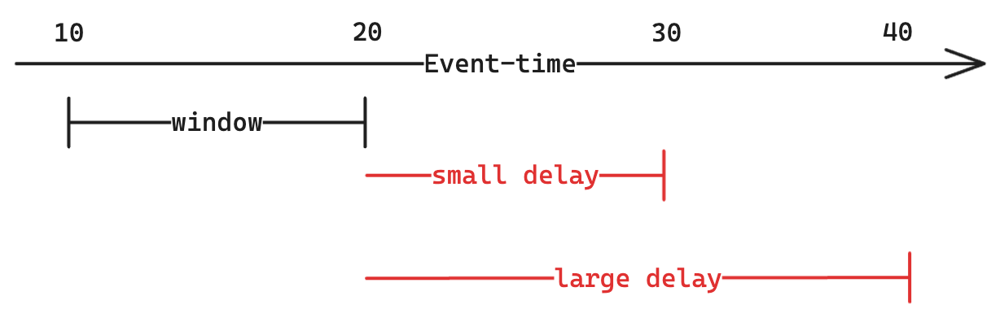

TODO.

## Introduction to Watermarks

By now, it should be reasonably clear that watermarks are important: they help us finalize aggregates, and they help us clean up intermediary buffered state. So how do we compute one?

With _arbitrarily_ delayed records, coming up with a watermark is impossible. If a record can be arbitrarily delayed, it can be delayed by an infinite amount of time; if it can be delayed by an infinite amount of time, it would arrive at timestamp "infinity". Then, the
re exists no timestamp before which we won't receive that record, since it will arrive at the end of time itself. Scary!

So, let's just assume that records aren't arbitrarily delayed, but rather have a maximum delay; for the sake of example, let's say this maximum delay is 30 minutes.

The time is now 2:45pm, in event-time. What can we say about the timestamp before which we won't receive records? If it's 2:45pm, the most possibly delayed event was sent at 2:15pm; if we were to now receive a record with event-time any earlier than that, it would more
delayed than the max delay. So, for 2:45pm, the timestamp before which we won't receive records is 2:45pm - 30 minutes = 2:15pm.

PUT-DIAGRAM-HERE

Now, let's assume that the streaming engine has received two records: one with eventtime 3:15pm, and another with eventtime 3:45pm. It can infer two things:

1. Since it just received the 3:15pm record, it wont't receive anything before 3:15pm 30 minutes = 2:45pm.
2. Since it just received the 3:45pm record, it won't receive anything before 3:45pm 30 minutes = 3:15pm.

The second condition implies the first, so the streaming engine is able to set its _watermark_ to be 3:15pm. It will receive no more records before 3:15pm. To generalize, if the streaming engine sees `t1` and `t2`, it sets its watermark to be `MAX(t1, t2) - delay`. Thi
s works for any number of timestamps, `t1` through `tn`.

## Aggregation and watermarks

As we mentioned in the previous section, watermarks enable the aggregation operator to do two things:

1. Emit windows whose end-times are less than the watermark
2. Purge from state windows whose end-times are less than the watermark

Both of these will happen for unfinalized windows, so long as the watermark is increasing. If the watermark increases quickly, then windows will be emitted quickly. If the watermark increases slowly, then windows will be emitted slowly. In other words, your watermark d
elay is directly proportional to how long windows take to finalize. Consider this example:

In this example, we have one window spanning from 10 to 20. We can finalize it and clean it up from state when the watermark exceeds its end, i.e. 20. We contrast two watermark delays:

1. This watermark delay of 10 units is "small". We will need to receive a record with event-time 30 (20 + 10) for the watermark to advance enough to close this window.
2. The other watermark delay of 20 units is "large". We will need to receive a record with event-time _40_ (20 + 20) for the watermark to advance enough to close this window.

So clearly, the watermark delay is influencing the latency of our pipeline. A smaller watermark delay means we wait for less time before windows close. So, naturally you might think, "oh, low-latency is good, so let's go with the smaller watermark." Beware: there's a s
ubtle tradeoff.

If your watermark delay is smaller than the maximum delay, you could finalize your windows before receiving all records (i.e. low-latency, and less correctness). If your watermark delay is set to be larger than the maximum delay, you could finalize your windows _after_
receiving all records (i.e. high-latency, high correctness). In practice, you'll usually have SLAs on how delayed data can be, so you should use that to set your watermark delay.

That was a lot of information, so if you take away anything, let it be these two things:

- Watermarks are the timestamp before which you no longer receive records
- A small watermark delay means low latency, but lower correctness; a higher watermark delay means higher latency, but higher correctness
